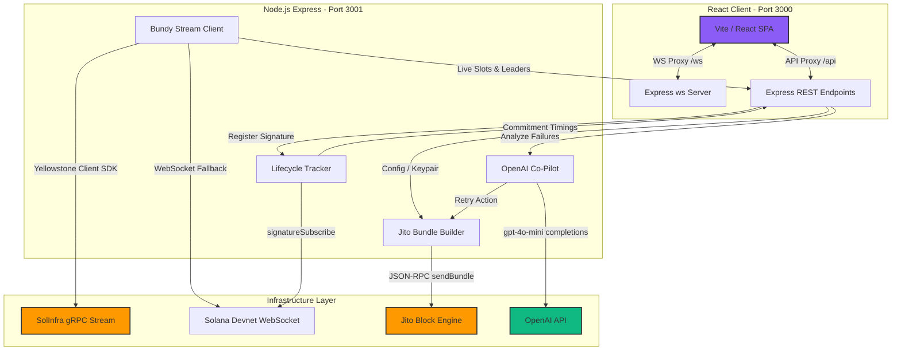
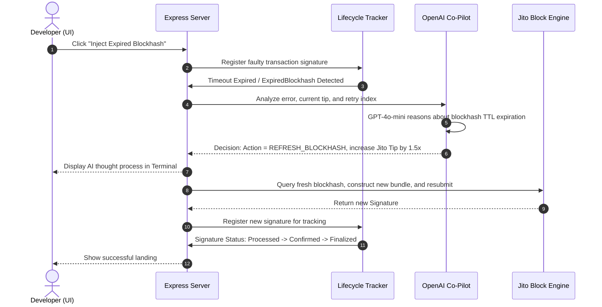

# 📦 Bundy: Architecture Design Document

Bundy is a developer sandbox designed to monitor the Solana network in real-time and submit Jito bundles. This document outlines the technical implementation, file layout, data flows, and infrastructure decisions that govern the system.

---

## 1. Component Architecture

---

## 2. Infrastructure Decisions

### A. SolInfra Geyser Integration via Triton SDK
* **Decision**: We integrated the official `@triton-one/yellowstone-grpc` client SDK to connect directly to SolInfra's Yellowstone Geyser node.
* **TLS Configuration**: To prevent TCP socket handshake failures, the endpoint is configured with a secure `https://` prefix (e.g. `https://fra.grpc.solinfra.dev:443`). This instructs the NAPI-rs gRPC wrapper to negotiate a TLS handshake, enabling secure HTTP/2 streams.
* **Resilient Fallback**: Since gRPC channels can be closed due to rate limits or ISP firewalls, the stream client features a WebSocket fallback. If the gRPC connection fails, it falls back to standard RPC WebSockets (`wss://api.devnet.solana.com/`) and begins an exponential backoff reconnect loop to SolInfra.

### B. Wallet Address and Balance Persistence
* **Decision**: Generate and save testing credentials locally in the workspace.
* **Implementation**: On startup, if `.env` does not contain `FUNDER_PRIVATE_KEY`, the server generates a new Keypair, encodes the private key as base58, and writes it directly back to the `.env` file. On subsequent runs and browser refreshes, the keypair is reloaded from `.env`, maintaining your wallet address and balance.

### C. Developer proxy Routing (Vite Dev Server)
* **Decision**: Establish a dev-server proxy inside `vite.config.ts`.
* **Implementation**: Vite proxies all `/api` calls to `http://localhost:3001` and `/ws` to `ws://localhost:3001`. This allows the frontend to run entirely on relative paths, completely avoiding CORS (Cross-Origin Resource Sharing) blockages and port hardcoding.

### D. OpenAI Chat Completions with Structured JSON
* **Decision**: Use `gpt-4o-mini` to reason about failed transactions.
* **Implementation**: Integrates `response_format: { type: 'json_object' }` to force OpenAI to output valid, structured JSON. The AI agent inspects error strings, categorizes them, explains the root cause in markdown, and suggests new tip parameters. If the API key is not present, a local reasoning engine acts as a fallback to ensure offline usability.

---

## 3. Data Flow: Transaction Lifecycle

The sequence diagram below maps the timeline of a transaction bundle through Bundy's pipeline:

```mermaid
sequenceDiagram
    autonumber
    actor Dev as Developer (UI)
    participant Server as Express Server
    participant Jito as Jito Block Engine
    participant Geyser as SolInfra gRPC Stream
    participant Tracker as Lifecycle Tracker
    participant Agent as OpenAI Co-Pilot

    Dev->>Server: Click "Send Jito Bundle"
    Server->>Jito: Fetch Tip Floor & submit serialized bundle
    Jito-->>Server: Return Bundle ID
    Server->>Tracker: Register signature for tracking
    Tracker->>Server: Signature subscribed (ws)
    
    rect rgb(20, 20, 35)
        note right of Geyser: Slot updates streamed in real-time
        Geyser->>Server: Slot notification (Slot 319208000)
    end

    Tracker->>Server: Signature Status: Processed (Slot 319208001)
    Server-->>Dev: Update Progress bar (+1000ms latency)
    
    Tracker->>Server: Signature Status: Confirmed (Slot 319208003)
    Server-->>Dev: Update Progress bar (+1500ms latency)

    Tracker->>Server: Signature Status: Finalized (Slot 319208035)
    Server-->>Dev: Update Progress bar (Success)
    Server->>Server: Log entry saved to lifecycle.json
```

---

## 4. Sequence: Fault Recovery Loop

Below is the execution flow when a developer injects an expired blockhash:

---

## 5. Error Classification Matrix

| Error Code | Trigger Condition | AI Diagnosis | Resolution Action |
| :--- | :--- | :--- | :--- |
| **ExpiredBlockhash** | Transaction not landed within 150 slots of blockhash creation | Transaction TTL expired, likely due to a skipped Jito leader slot. | Fetch fresh blockhash, bump bundle tip by 1.25x, and resubmit. |
| **FeeTooLow** | Jito Block Engine rejects bundle due to fee minimums | Bundle tip falls below the competitive threshold of the current block. | Recalculate tip based on the 95th percentile, rebuild, and resubmit. |
| **ConfirmationTimeout**| Transaction processed by leader but not voted by validators | Network is experiencing severe voting lag or validator partition. | Abort retry attempt to prevent wasting SOL; flag manual inspection. |
